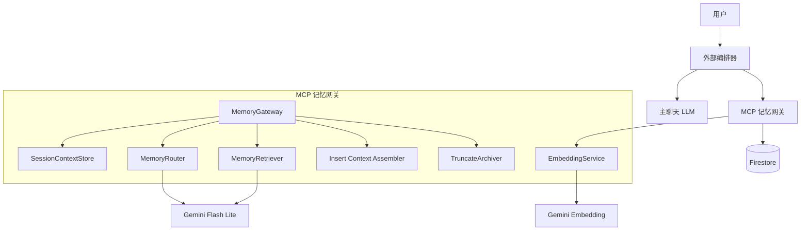
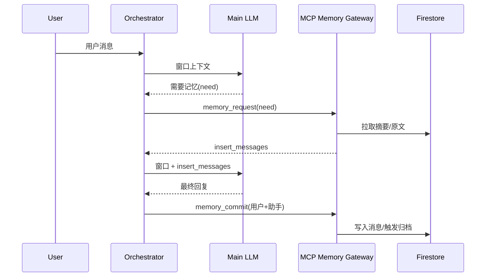

# MCP 记忆网关架构说明（热记忆系统）

本文档描述当前热记忆系统的总体架构、组件职责、数据结构与实现细节。目标是让“外部主聊天 LLM”负责理解与决策，MCP 只负责记忆检索、编排与归档。

## 1. 设计目标与原则
- **LLM-first**：主聊天 LLM 决定是否需要记忆，不强制每次都调用 MCP。
- **单一入口**：外部 LLM 仅调用 `memory_request` 获取上下文插入区。
- **热记忆优先**：优先使用当前会话的摘要与原文，冷记忆结构占位但不启用。
- **上下文分离**：最近对话窗口与插入区预算分开管理。
- **幂等与顺序**：按 session 串行写入与归档，避免重复入库。

## 2. 总体架构图



## 3. 外部交互流程

### 3.1 会话恢复（session_snapshot）
1. 编排器调用 `session_snapshot`。  
2. MCP 返回最近窗口消息 + 当前插入区。  
3. 编排器将返回的 `assembled_messages` 发给主 LLM 作为起始上下文。  

### 3.2 正常对话（无需记忆）
1. 编排器仅使用最近 120k tokens 的窗口对话。  
2. 不调用 MCP，直接让 LLM 回复。  
3. 编排器调用 `memory_commit` 写入用户/助手消息。  

### 3.3 需要记忆（memory_request）
1. 主 LLM 触发 `memory_request(need=自然语言需求)`。  
2. MCP：路由 -> 召回 -> 复排 -> 拼装插入区。  
3. 编排器将插入区与窗口合并后再次请求 LLM。  
4. 编排器调用 `memory_commit` 写入消息，触发归档队列。  



## 4. 对外工具接口

### 4.1 session_snapshot
用途：恢复会话上下文（不涉及语义理解）。

请求示例：
```json
{
  "user_id": "u1",
  "session_id": "s1",
  "window_tokens": 120000,
  "insert_budget_tokens": 20000
}
```

返回字段：
- `context.current_window_messages`：最近窗口消息  
- `insert_messages`：插入区 system 消息  
- `assembled_messages`：可直接喂给 LLM 的消息数组  

### 4.2 memory_request
用途：主 LLM 需要历史记忆时调用。

请求示例：
```json
{
  "user_id": "u1",
  "session_id": "s1",
  "need": "请给我与归档触发条件相关的记忆与原文"
}
```

返回字段：
- `context.current_session_topic_summaries`  
- `context.retrieved_memory_summary`  
- `context.retrieved_raw_messages`  
- `insert_messages`（system 消息数组）  

### 4.3 memory_commit
用途：编排器写入用户/助手消息，触发归档。

请求示例：
```json
{
  "user_id": "u1",
  "session_id": "s1",
  "messages": [
    {"role": "user", "content": "你好"},
    {"role": "assistant", "content": "你好，有什么可以帮你？"}
  ]
}
```

## 5. 数据模型与存储结构

### 5.1 Firestore 结构
```
users/{user_id}/
  sessions/{session_id}/
    created_at
    updated_at
    insert_context_messages: [ {role, content} ]
    insert_context_updated_at
    messages/{message_id}/
      role, content, timestamp, is_archived, token_count, thread_id
    topics/{topic_id}/
      title, summary, created_at
      threads/{thread_id}/
        title, summary, created_at
        insights/{insight_id}/
          content, version, evolution_note, embedding
    archived_messages/{message_id}/
      topic_id, thread_id, role, content, archived_at
```

### 5.2 关键字段说明
- `insert_context_messages`：插入区 system 消息数组（每次 `memory_request` 替换）。
- `token_count`：消息 token 数，用于窗口裁剪。
- `embedding`：见解向量（Gemini embedding）。

## 6. 上下文拼装策略
- **窗口预算**：默认 120k tokens（可配置）。  
- **插入预算**：默认 20k tokens（可配置）。  
  
插入区内容顺序：
1. 当前 session 话题总结  
2. 检索记忆总结  
3. 原文片段（按 thread 排序）  

插入区不做归档，丢弃即可。实际 token 仍会占用模型上下文预算。

## 7. 检索与排序策略
1. **MemoryRouter**：使用 Gemini Flash Lite 将自然语言 need 转为关键词与检索参数。  
2. **Embedding 召回**：对 thread 最新 insight 进行向量相似度匹配。  
3. **词面回退**：无 embedding 时用关键词命中率作为分数。  
4. **LLM 复排/摘要**：生成可读的记忆摘要。  

## 8. 并发与幂等
- `SessionContextStore` 为每个 session 使用锁，保证写入顺序。  
- 归档使用独立锁 + pending 标记，避免并发归档重复。  
- 写入时校验 message_id 去重，避免重复提交。  

## 9. 配置项
`app/config.py` 或环境变量：
- `MEMORY_WINDOW_TOKENS`  
- `MEMORY_INSERT_BUDGET_TOKENS`  
- `MEMORY_MAX_THREADS`  
- `MEMORY_MAX_RAW_MESSAGES`  
- `MEMORY_SESSION_TTL_SECONDS`  
- `MEMORY_STREAM_LOAD_LIMIT`  
- `EMBEDDING_PROVIDER` (`gemini`/`cloudflare`)  
- `GEMINI_EMBEDDING_MODEL`  
- `GEMINI_FLASH_MODEL`  

## 10. 实现细节（关键文件）
- `app/mcp/memory_gateway.py`  
  - `MemoryGateway.session_snapshot`  
  - `MemoryGateway.memory_request`  
  - `MemoryGateway.memory_commit`  
  - `SessionContextStore`：窗口恢复、插入区缓存  
  - `MemoryRouter`：自然语言路由  
  - `MemoryRetriever`：embedding 召回 + 复排  
- `app/services/embedding_service.py`  
  - Gemini embedding + Cloudflare 备用  
- `app/mcp/truncate_archiver.py`  
  - 归档时生成 insight embedding  
- `app/services/firestore_service.py`  
  - session_state、embedding 写入、token_count  
- `app/mcp/message_stream.py`  
  - 可配置窗口 token 上限  

## 11. 测试策略
单元测试：
```
PYTHONPATH=backend pytest tests/test_memory_gateway.py -v
```
集成测试（需 Firestore/Gemini）：
```
./venv/bin/python -m pytest ../tests/test_integration.py -v -s
```

## 12. 待办与扩展
- 冷记忆：跨 session 检索、长期向量索引  
- 更细粒度的召回策略（时间窗 + 标签）  
- 插入区多版本缓存与回滚  

