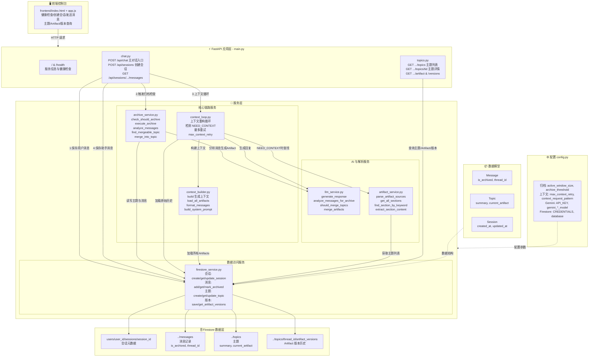

```mermaid
flowchart TB
    subgraph Frontend["🖥️ 前端控制台"]
        FE["frontend/index.html + app.js<br>健康检查/创建会话/发送消息<br>主题/Artifact/版本查询"]
    end

    subgraph FastAPI["⚡ FastAPI 应用层 - main.py"]
        direction TB
        HEALTH["/ & /health<br>服务信息与健康检查"]
        CHAT["chat.py<br>POST /api/chat 主对话入口<br>POST /api/sessions 创建会话<br>GET /api/sessions/.../messages"]
        TOPICS["topics.py<br>GET .../topics 主题列表<br>GET .../topics/tid 主题详情<br>GET .../artifact & /versions"]
    end

    subgraph Services["🔧 服务层"]
        direction TB
        
        subgraph CoreServices["核心链路服务"]
            CTX_LOOP["context_loop.py<br>上下文重构循环<br>检测 NEED_CONTEXT<br>最多重试 max_context_retry"]
            CTX_BUILD["context_builder.py<br>build 生成上下文<br>load_all_artifacts<br>format_messages<br>build_system_prompt"]
            ARCHIVE["archive_service.py<br>check_should_archive<br>execute_archive<br>analyze_messages<br>find_mergeable_topic<br>merge_into_topic"]
        end
        
        subgraph AIServices["AI 与解析服务"]
            LLM["llm_service.py<br>generate_response<br>analyze_messages_for_archive<br>should_merge_topics<br>merge_artifacts"]
            ARTIFACT["artifact_service.py<br>parse_artifact_sources<br>get_all_sections<br>find_section_by_keyword<br>extract_section_content"]
        end
        
        subgraph DataService["数据访问服务"]
            FS["firestore_service.py<br>会话: create/get/update_session<br>消息: add/get/mark_archived<br>主题: create/get/update_topic<br>版本: save/get_artifact_versions"]
        end
    end

    subgraph Storage["🗄️ Firestore 数据层"]
        direction LR
        SESSIONS["users/user_id/sessions/session_id<br>会话元数据"]
        MESSAGES["../messages<br>消息记录<br>is_archived, thread_id"]
        TOPICS_DB["../topics<br>主题<br>summary, current_artifact"]
        VERSIONS["../topics/thread_id/artifact_versions<br>Artifact 版本历史"]
    end

    subgraph Config["⚙️ 配置 config.py"]
        CFG["归档: active_window_size, archive_threshold<br>上下文: max_context_retry, context_request_pattern<br>Gemini: API_KEY, gemini_*_model<br>Firestore: CREDENTIALS, database"]
    end

    subgraph Models["📦 数据模型"]
        MSG["Message<br>is_archived, thread_id"]
        TOPIC["Topic<br>summary, current_artifact"]
        SESSION["Session<br>created_at, updated_at"]
    end

    %% 主要连接
    FE -->|HTTP 请求| FastAPI
    
    CHAT -->|1.保存用户消息| FS
    CHAT -->|2.触发归档检查| ARCHIVE
    CHAT -->|3.上下文循环| CTX_LOOP
    CHAT -->|4.保存助手消息| FS
    
    ARCHIVE -->|分析消息生成Artifact| LLM
    ARCHIVE -->|读写主题与消息| FS
    
    CTX_LOOP -->|构建上下文| CTX_BUILD
    CTX_LOOP -->|生成回复| LLM
    CTX_LOOP -->|NEED_CONTEXT时查找| ARTIFACT
    CTX_LOOP -->|加载原始历史| FS
    
    CTX_BUILD -->|加载所有Artifacts| FS
    
    ARTIFACT -->|获取主题列表| FS
    
    TOPICS -->|查询主题/Artifact/版本| FS
    
    FS --> SESSIONS
    FS --> MESSAGES
    FS --> TOPICS_DB
    FS --> VERSIONS
    
    CFG -.->|配置参数| Services
    Models -.->|数据结构| FS
```
